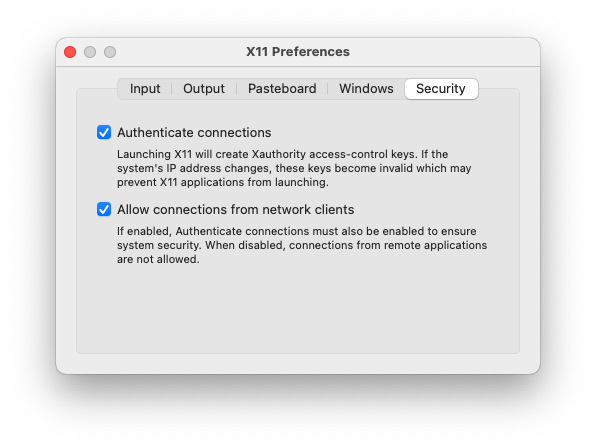
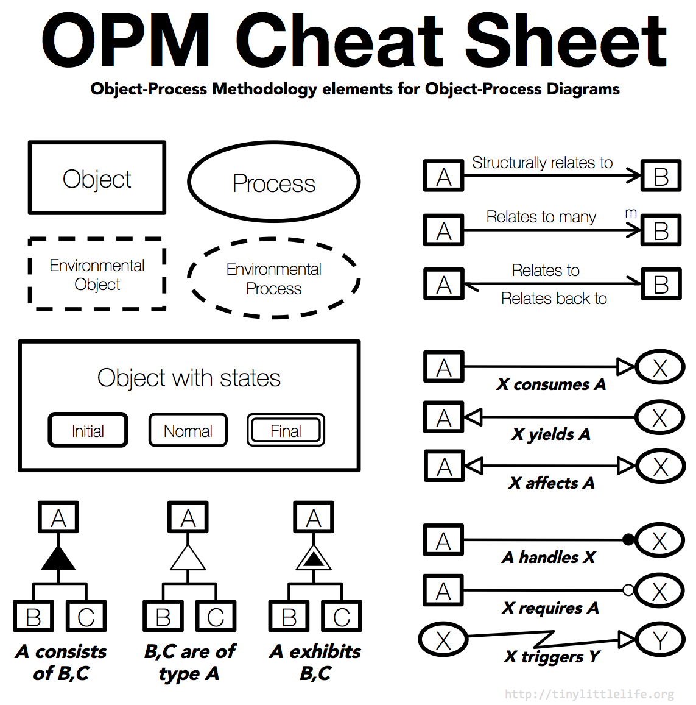

# Object Process Methodology OPCAT tool on OSX  [](https://hub.docker.com/r/ianfixes/opcat) [](https://hub.docker.com/r/ianfixes/opcat)

This project attempts to revive the [OPM OPCAT tool](http://esml.iem.technion.ac.il/opcat-installation/) on OSX, which is a bit tricky given that the software only runs on Java 8.  We work around this by [running the application in Docker and using XQuartz](https://cntnr.io/running-guis-with-docker-on-mac-os-x-a14df6a76efc)


## Installing dependencies

You will need `Docker`.

You will also need `XQuartz` and `socat`.  At the time of this writing, those are best installed via `brew`.

```console
$ brew install xquartz socat
```

The XQuartz installation will require you to log out and back in to complete the installation.  You must then open Xquartz preferences and select "Allow connections from network clients":


## Running OPCAT

This `opcat.sh` script will start socat, Xquartz, and the docker container such that `conf.txt` is saved to your OSX Documents directory.  This allows you to work around an observed issue in MacOSX/Big Sur + Java 8 where trying to open or save a system diagram will cause opcat to stop responding.

```bash
#!/bin/bash

# Start socat, which will be our connection to XQuartz

if ! which Xquartz ; then
  echo Xquartz doesnt seem to be installed
  exit 1
fi

echo Starting socat
trap 'kill $SOCAT_PID; exit' INT
socat TCP-LISTEN:6000,reuseaddr,fork UNIX-CLIENT:\"$DISPLAY\" &
SOCAT_PID=$?
sleep 1

if ! pgrep -i xquartz ; then
  echo Starting Xquartz
  open -a /Applications/Utilities/XQuartz.app

  while ! pgrep -i xquartz ; do
    echo Waiting for Xquartz launch
    sleep 3
  done
fi

docker run --rm -it \
  -e DISPLAY=host.docker.internal:0.0 \
  -e USER=${USER} \
  -e HOME=/Users/${USER} \
  --volume /Users/${USER}/Documents:/documents \
  -u $(id -u ${USER}):$(id -g ${USER}) \
  opcat:latest

echo Terminating socat pid $SOCAT_PID
kill $SOCAT_PID
```

## OPM Cheat Sheet

